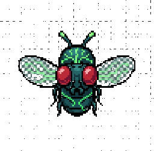

<div align="center">



# SynapseFly · $SYNAPSE

**A real fruit-fly brain, wired to the market — live.**

We simulate the connectome of a *Drosophila* male central nervous system as a spiking neural
network, plug live market data into its senses, and let its motor neurons paint the price on a
Windows-95 Paint canvas. When it panics or feels euphoric, it tweets its own brain state.

[🌐 **Live** → synapsefly.com](https://www.synapsefly.com) · [𝕏 **@SynapseFly**](https://x.com/SynapseFly)

</div>

---

## What this is

Neuroscience × reinforcement-style sensory loops × web × crypto, in one absurd but technically
deep artifact. Everything you see on screen is derived from the firing rates of **real, named
neuron populations** — labellar sugar GRNs, the MN9 proboscis motor neuron, the DNp01 giant fiber,
the LC4 / LPLC2 looming detectors, the DNa02 steering descending neuron, PAM dopaminergic neurons,
and more — taken from Janelia FlyEM's map of the fly brain.

- **The market is its senses.** A buy / price-up injects current into the fly's **sugar** receptor
  neurons — it gets happy, wanders, loops. A sell / price-down lights up its **looming-danger**
  (LC4/LPLC2 → giant fiber) and **escape** circuits — it panics, darts, and hides.
- **The fly is its body.** Motor-neuron output is decoded into `(x, y)` velocity, heading and
  wing-beat frequency; the fly moves across an 800×500 canvas and leaves an ink trail colored by
  the candle.
- **The oscilloscope is its brain.** A live spike-raster panel shows each region (optic lobe,
  antennal lobe, mushroom body, central complex, SEZ, descending/motor) actually firing.
- **The agent is its voice.** When mood crosses a euphoria/panic threshold, the brain-state JSON
  becomes a prompt and an LLM writes a short, in-character crypto tweet.

> **Scientific honesty.** The default brain is a **synthetic, MaleCNS-shaped** stand-in: a
> structured generator that reproduces the real region taxonomy, cell-type labels and verified
> pathway weights (see [`docs/RESEARCH.md`](docs/RESEARCH.md)), calibrated so the documented
> circuits fire. The **real** Janelia MaleCNS connectome, a live token feed, a real LLM and X
> posting are each one environment variable away. Nothing here is financial advice — it's a bug.

## How it works

```
                 ┌─────────────────────────────────────────────────────────────┐
   market data   │  encoder            SNN engine (LIF, ~166k neurons)          │   decoder
  ───────────►   │  buys → sugar GRNs   ┌───────────────────────────────────┐   │  motor pops
 (DexScreener /  │  sells → LC4/LPLC2   │ event-driven CSR propagation, dt=1 │   │  → (x,y),
    simulated)   │  → injected current  │ ms, ~2× realtime on CPU (numpy)    │   │  heading,
                 │                      └───────────────────────────────────┘   │  wing-beat
                 └──────────────┬──────────────────────────┬────────────────────┘
                                │ spike raster              │ mood state machine
                                ▼                           ▼
                    live WebSocket (20 Hz)  ──►  Next.js "Paint" canvas + panels + tweet agent
```

- **Backend** — Python (FastAPI + native WebSocket). A pure-numpy event-driven leaky-integrate-and-fire
  engine (optional Torch backend) runs the connectome as one CSR graph; a market feed, sensory
  encoder, motor decoder, 8-state mood machine and tweet agent hang off a 20 Hz simulation loop.
- **Frontend** — Next.js + TypeScript + Tailwind, a retro Windows-95 desktop: draggable Paint,
  Oscilloscope, Fly Status and tweets.txt windows, all fed from one WebSocket.

Full engineering contract: [`docs/SPEC.md`](docs/SPEC.md) · verified neuroscience &
data-access notes: [`docs/RESEARCH.md`](docs/RESEARCH.md) · data provenance:
[`docs/NOTICE.md`](docs/NOTICE.md).

## Run it locally (offline, zero accounts)

Requires Python 3.12+ and Node 18+. From the repo root:

```bash
# backend (the brain) on http://127.0.0.1:4000
cd backend
pip install -r requirements.txt
python run.py
```

```bash
# frontend (the page) on http://localhost:3000
cd frontend
npm install
npm run dev            # set NEXT_PUBLIC_WS_URL / NEXT_PUBLIC_API_URL to point elsewhere
```

Open http://localhost:3000. With no configuration it runs a synthetic brain, a simulated market
and a dry-run agent — the fly moves, paints and "tweets" entirely offline. Sanity checks:

```bash
python scripts/selftest.py --fast     # 5 biological gates + realtime factor
python scripts/smoke.py --fast        # 2000-step behavioural smoke test
cd backend && python -m pytest -q     # full test suite
```

## Going live

| What | Env |
|---|---|
| Real Janelia MaleCNS data | `FLY_CONNECTOME_SOURCE=neuprint` (+ neuPrint token) or `csv` |
| Real token market | `FLY_MARKET=dexscreener`, `FLY_TOKEN_ADDRESS`, `FLY_CHAIN` |
| Real LLM tweets | `FLY_LLM=anthropic`, `ANTHROPIC_API_KEY` |
| Real X posting | `FLY_X=post`, `X_*` OAuth keys |
| Bigger brain | `FLY_N_NEURONS=166700` |

Production topology and a step-by-step deploy (frontend on Vercel, backend on a VPS behind Caddy):
[`deploy/DEPLOY.md`](deploy/DEPLOY.md). Every environment variable is documented in
[`.env.example`](.env.example).

## Data & license

The neuroscience is built on Janelia FlyEM's **MaleCNS v1.0** connectome (~166k neurons, ~125M
synapses), released **CC-BY 4.0**. See [`docs/NOTICE.md`](docs/NOTICE.md) for citations and DOIs.
Project code is released for people to inspect and understand how the system works — this repository
is the proof that the fly on the screen is driven by a real neural architecture, not a puppet.

---

<div align="center">
<sub>Built with connectomics, a spiking-neural-net, and a sense of humor. Not financial advice — it's a bug. 🪰</sub>
</div>

<sub>synapsefly.com · @SynapseFly</sub>
